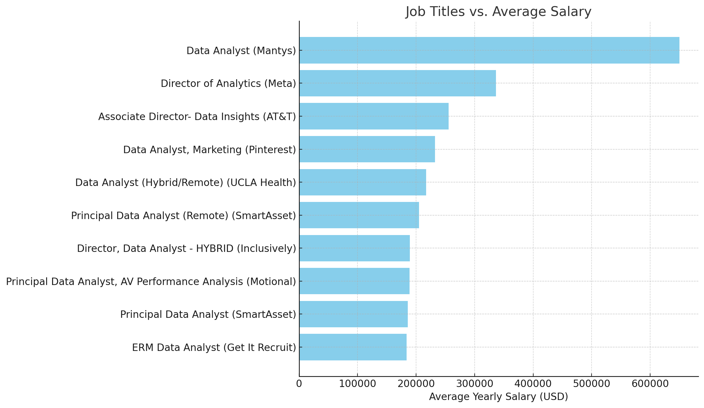
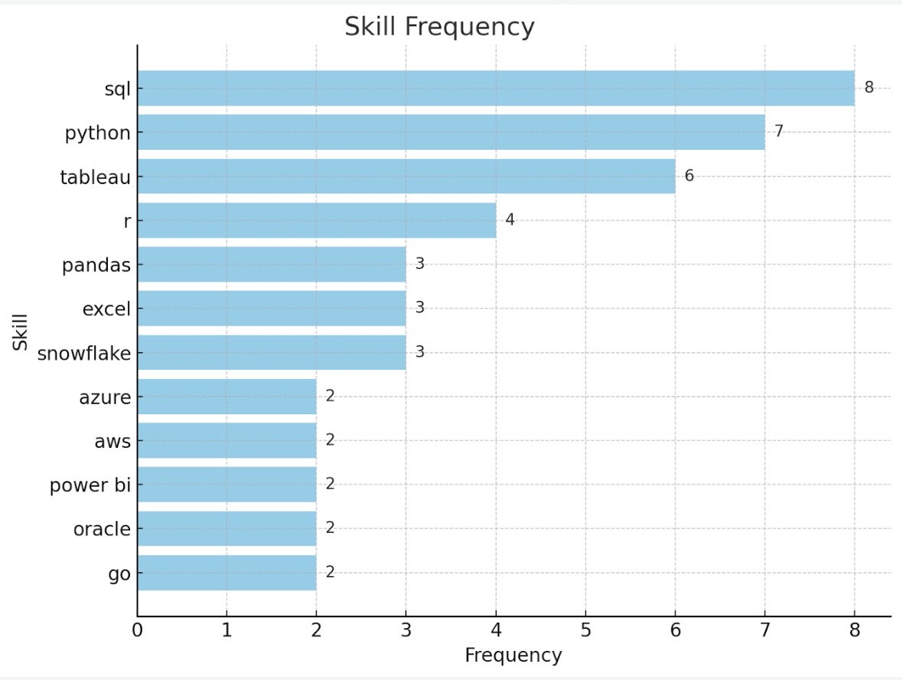

# Introduction
Explore the data job market with a focus on data analyst roles! This project delves into the highest-paying positions, in-demand skills, and where salary and demand intersect within the field of data analytics.

Interested in SQL queries? You can check them out here: [project sql folder](/project%20sql/).

# Background
This project was born out of a desire to better navigate the data analyst job market by identifying high-paying roles and the skills most sought after by employers. The goal is to help others find optimal job opportunities by streamlining their job search.

The data used in this project comes from Mr. Luke Barousse's [SQL Course](https://www.lukebarousse.com/sql). It provides valuable insights into job titles, salaries, locations, and the essential skills required for data analyst positions.

## The key questions I sought to answer through my SQL queries were:
1. What are the highest-paying remote data analyst jobs?
2. What skills are necessary for these high-paying roles?
3. Which skills are most in demand for data analysts?
4. Which skills are linked to higher salaries?
5. What are the most optimal skills to learn?

# Tools I Used
To dive deep into the data analyst job market, I leveraged several key tools:

- **SQL:** The backbone of my analysis, used to query the database and uncover essential insights.

- **PostgreSQL:** The database management system chosen for handling the job posting data.

- **Visual Studio Code:** My preferred tool for managing the database and running SQL queries.

- **Git & GitHub:** Critical for version control and sharing SQL scripts, enabling collaboration and tracking the project’s progress.

# The Analysis
## 1. Top Paying Data Analyst Jobs
To identify the highest-paying roles, I filtered data analyst positions based on average annual salary and focused specifically on remote opportunities. This approach highlights the most lucrative positions available in the field.

```sql
SELECT 
    j.job_id, 
    j.job_title,
    j.job_location,
    j.job_schedule_type,
    j.salary_year_avg,
    j.job_posted_date,
    c.name AS company_name
FROM 
    job_postings_fact AS j
LEFT JOIN 
    company_dim AS c
ON 
    c.company_id = j.company_id
WHERE 
    job_title_short = 'Data Analyst' AND
    job_location = 'Anywhere' AND
    salary_year_avg IS NOT NULL
ORDER BY
    salary_year_avg DESC
LIMIT 10;
```

### Key Insights:
- **Job Title Variety:** Titles range from Data Analyst to Director of Analytics, reflecting a mix of seniority levels and specializations within the field.
- **Remote Jobs Can Be Lucrative:** Some fully remote positions offer salaries well above typical market rates, with the top job paying $650,000/year, which suggests either equity-heavy compensation packages or high-value roles in niche sectors.
- **Diverse Set of Employers:** Top employers range from tech giants (Meta, Pinterest) to less mainstream but competitive firms (Mantys, SmartAsset), showing wide demand across company sizes for high-level remote data talent.


***Figure 1:** Bar graph for avg. annual salary for remote data analyst roles in 2023 (ChatGPT generated from my SQL query results)*

## 2. Skills for Top Paying Jobs
I identified the most in-demand technical skills associated with these top-paying positions by extracting and joining data across job, company, and skill dimensions and focusing on roles that were fully remote and included salary data.

```sql
WITH top_paying_jobs AS (
    SELECT 
        job_id, 
        job_title,
        salary_year_avg,
        name AS company_name
    FROM 
        job_postings_fact
    LEFT JOIN 
        company_dim
    ON 
        company_dim.company_id = job_postings_fact.company_id
    WHERE 
        job_title_short = 'Data Analyst' AND
        job_location = 'Anywhere' AND
        salary_year_avg IS NOT NULL
    ORDER BY
        salary_year_avg DESC
    LIMIT 10
)

SELECT 
    top_paying_jobs.*,
    skills
FROM 
    top_paying_jobs
INNER JOIN skills_job_dim ON skills_job_dim.job_id = top_paying_jobs.job_id
INNER JOIN skills_dim ON skills_dim.skill_id = skills_job_dim.skill_id
ORDER BY
    salary_year_avg DESC;
```

### Key Insights:
- **SQL, Python, and Tableau** were the most consistently required skills across nearly all high-paying roles, indicating their foundational value in remote data analyst positions.
- **Cloud and big data tools** such as AWS, Azure, Snowflake, and Databricks appeared frequently, suggesting a strong demand for experience in modern data infrastructure.
- **Communication and visualization** tools like Power BI, Excel, and PowerPoint were also prevalent, highlighting the importance of presenting data-driven insights effectively.
- **Skill Count:** SQL is the most in-demand skill, appearing in 8 of the top 10 job postings. Python is a close second, required in 7 listings. Tableau is used in 6 jobs. R is included in 4 roles, especially where statistical analysis is needed. Snowflake, Pandas and Excel appear in 3 listings.


***Figure 2:** Bar graph for skill count for top 10 paying data analyst jobs in 2023 (ChatGPT generated from my SQL query results)*

## 3. In-Demand Skills for Data Analysts
To identify the most in-demand skills for remote Data Analyst roles, I queried job postings for positions titled "Data Analyst" with the location set to "Anywhere." By joining the job postings with skill data and aggregating the results, I was able to determine which technical skills appeared most frequently across these roles.

```sql
SELECT 
    skills,
    COUNT(job_postings_fact.job_id) as skills_demand_count
FROM 
    job_postings_fact
INNER JOIN skills_job_dim ON skills_job_dim.job_id = job_postings_fact.job_id
INNER JOIN skills_dim ON skills_dim.skill_id = skills_job_dim.skill_id
WHERE 
    job_title_short = 'Data Analyst'
    AND job_location = 'Anywhere'
GROUP BY 
    skills
ORDER BY 
    skills_demand_count DESC
LIMIT 5;
```
### Key Insights:
- **SQL is the top skill,** appearing in over 7,000 job postings, highlighting its foundational importance in data analysis.
- **Excel, Python, and Tableau** are also in high demand, reinforcing the need for both data manipulation and visualization tools.
- **Power BI ranks fifth,** suggesting a strong industry preference for Microsoft’s BI stack alongside Excel for dashboarding and reporting.

| Skill     | Demand Count |
|-----------|--------------|
| SQL       | 7,291        |
| Excel     | 4,611        |
| Python    | 4,330        |
| Tableau   | 3,745        |
| Power BI  | 2,609        |

***Table 1:** In-Demand Data Skills*

## 4. Top Skills Based on Salary
To identify the most financially rewarding skills for remote Data Analyst roles, I queried job postings data to calculate the average salaries associated with each skill. By filtering for roles titled "Data Analyst," located "Anywhere," and with known salary values, I ranked the top 10 skills based on their average annual salary.

```sql
SELECT
  skills,
  ROUND(AVG(salary_year_avg),0) AS avg_salary
FROM 
  job_postings_fact
INNER JOIN skills_job_dim ON skills_job_dim.job_id = job_postings_fact.job_id
INNER JOIN skills_dim ON skills_dim.skill_id = skills_job_dim.skill_id
WHERE 
  job_title_short = 'Data Analyst' AND
  job_location = 'Anywhere' AND
  salary_year_avg is NOT NULL
GROUP BY
  skills
ORDER BY
  avg_salary DESC
LIMIT 10;
```

### Key insights:
- **PySpark** is the most lucrative skill, associated with an average annual salary of $208,172, indicating high demand for big data and distributed computing capabilities.
- **Several DevOps and cloud tools like Bitbucket and GitLab** rank high in salary, reflecting the value of version control and CI/CD knowledge even in data analyst roles.
- **Specialized tools and libraries such as Watson, DataRobot, and Jupyter** show that familiarity with AI/ML platforms and interactive computing environments boosts earning potential.

| Skill         | Average Salary (USD) |
|---------------|----------------------|
| PySpark       | 208,172              |
| Bitbucket     | 189,155              |
| Watson        | 160,515              |
| Couchbase     | 160,515              |
| DataRobot     | 155,486              |
| GitLab        | 154,500              |
| Swift         | 153,750              |
| Jupyter       | 152,777              |
| Pandas        | 151,821              |
| Elasticsearch | 145,000              |

***Table 2:** High-paying technical skills based on average salary*

## 5. Most Optimal Skills to Learn
To determine the most optimal skills for remote Data Analyst roles — those that are both high in demand and offer high average salaries — I queried job postings with salary data and grouped them by skill. I filtered to include only skills with more than 10 postings to ensure reliability, and then sorted the results by average salary and demand.

```sql
SELECT
    skills_dim.skill_id,
    skills_dim.skills,
    COUNT(skills_job_dim.job_id) as skills_demand_count,
    ROUND(AVG(job_postings_fact.salary_year_avg),0) AS avg_salary
FROM
    job_postings_fact
INNER JOIN skills_job_dim ON skills_job_dim.job_id = job_postings_fact.job_id
INNER JOIN skills_dim ON skills_dim.skill_id = skills_job_dim.skill_id
WHERE 
    job_title_short = 'Data Analyst'
    AND job_location = 'Anywhere'
    AND salary_year_avg is NOT NULL
GROUP BY
    skills_dim.skill_id
HAVING
    COUNT(skills_job_dim.job_id) > 10
ORDER BY
    avg_salary DESC,
    skills_demand_count DESC;
```

### Key Insights:
- **High-paying but lower-demand skills like Go, Hadoop, and Confluence** may present niche opportunities for specialization and differentiation in the job market.
- **Python, SQL, Tableau, and Power BI** stand out as foundational skills with both high demand and strong salary potential, making them essential for career growth.
- **Emerging tools like Snowflake, Looker, and AWS** offer competitive salaries and increasing relevance, suggesting a growing emphasis on cloud-based data solutions.

| Skill       | Demand Count | Average Salary (USD) |
|-------------|--------------|----------------------|
| Go          | 27           | 115,320              |
| Confluence  | 11           | 114,210              |
| Hadoop      | 22           | 113,193              |
| Snowflake   | 37           | 112,948              |
| Azure       | 34           | 111,225              |
| BigQuery    | 13           | 109,654              |
| AWS         | 32           | 108,317              |
| Java        | 17           | 106,906              |
| SSIS        | 12           | 106,683              |
| Jira        | 20           | 104,918              |

***Table 3:** Top 10 tech skills based on demand and average salary*

# What I learned
I dove deep into the data analytics job market and came up with more than just insights—SQL skills and job market wisdom in hand.

- **Advanced SQL Skills:** I developed strong SQL skills, including writing complex queries with CTEs, JOINs, GROUP BY, and aggregation functions like COUNT(), and AVG(). I also learned to apply WHERE for pre-aggregation filters and HAVING for post-aggregation, enabling precise data analysis and efficient handling of large datasets.
- **Salary and Skill Correlation:** I analyzed how specific skills—such as PySpark, AWS, and Tableau—relate to higher salaries in data analytics. This enhanced my ability to identify and correlate key factors in a dataset and derive actionable insights.
- **Data Analysis and Market Trends:** By examining job postings, I identified trends in the data analyst job market, such as in-demand skills and remote work availability. This helped me understand high-paying roles and growth areas in the field.
- **Version Control and Collaboration:** I improved my use of Git and GitHub for version control, allowing effective collaboration, organized project tracking, and streamlined SQL script management—crucial for teamwork in data analytics projects.

# Conclusions
This analysis highlights the strong demand for skilled data analysts, particularly in remote roles, with employers seeking both foundational and advanced skills. Specializing in emerging technologies like cloud platforms (AWS, Snowflake) and AI/ML tools (TensorFlow, DataRobot) can significantly boost salary potential. Remote work has become a key factor in attracting top talent, offering high-paying opportunities globally. Overall, mastering a mix of core technical skills (SQL, Excel, Python) and specialized tools (Tableau, Power BI, Jupyter) is essential for career progression and accessing lucrative roles in the data analytics field.